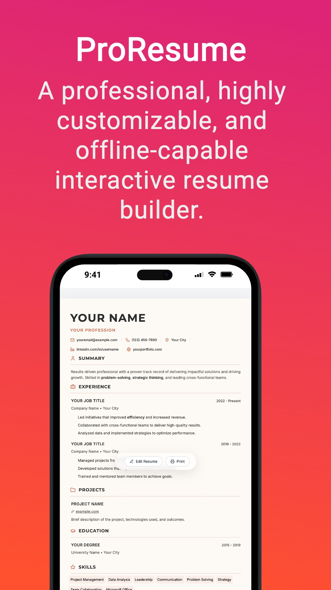
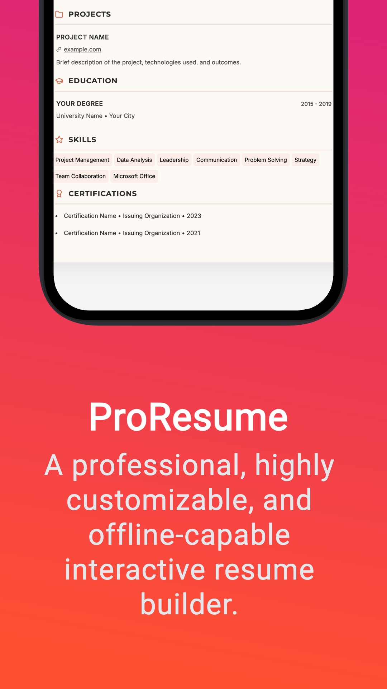
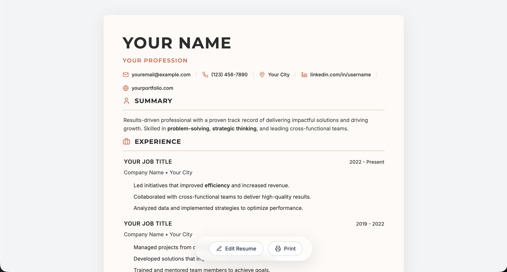

# 📄 PocketResume Builder PWA

[](https://masterkn48.github.io/resumeBuilderPWA/)
[](https://masterkn48.github.io/resumeBuilderPWA/)

Easy, instant resume management with full offline capabilities. Build your professional resume with a live preview, drag-and-drop sections, and flawless PDF export.

[**🌐 Launch App**](https://masterkn48.github.io/resumeBuilderPWA/)

## 📸 Screenshots

<p align="center">
  
  
</p>

<p align="center">
  
</p>

## ✨ Features

- **PWA & Offline:** Install natively on any device; works without internet.
- **Dynamic Layout:** Drag & drop sections to rearrange your resume.
- **Smart Editing:** Markdown bolding, custom page breaks, and auto-saving.
- **Print Perfect:** 1:1 PDF fidelity with customizable margins and typography.
- **Conditional UI:** Unused fields (LinkedIn, Portfolio) hide automatically.

## Development

This project uses `bun` as its primary package manager.

```bash
# Install dependencies
bun install

# Start development server
bun run dev

# Build for production
bun run build
```

## Deployment to GitHub Pages

This repository is pre-configured to easily deploy to GitHub Pages.

1. Ensure the `base: './'` is set in your `vite.config.js`.
2. Run the deploy script:

```bash
bun run deploy
```

This will automatically build your application and push the compiled `dist` folder to the `gh-pages` branch, making it live on the web!

---

## Best Results for Printing

To get a perfect PDF export every time, follow these settings in your browser's print dialog:

1. **Destination:** Save as PDF
2. **Margins:** Set to **Default** or **None** (The app handles its own 15mm margins).
3. **Options:** Ensure **Background Graphics** is **checked** (important for accent colors and skill chips).
4. **Paper Size:** A4 or Letter (both are supported by the dynamic layout).
