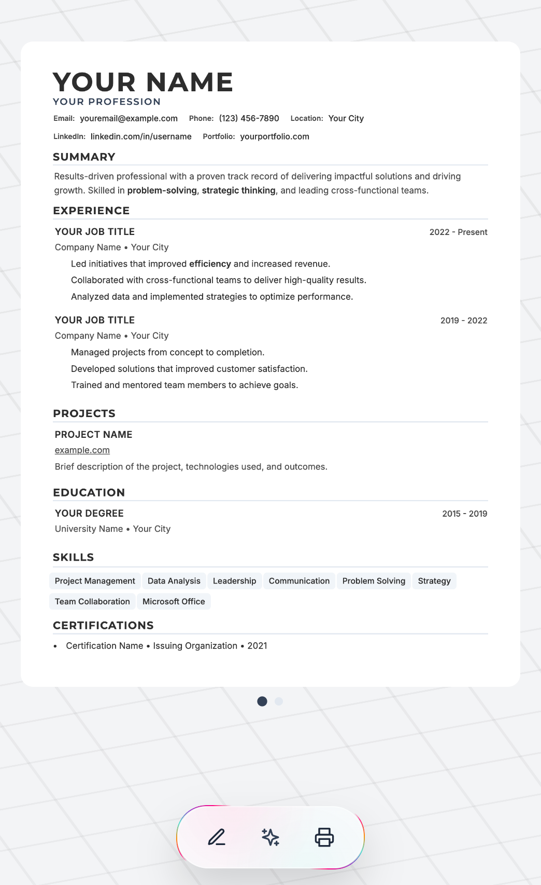
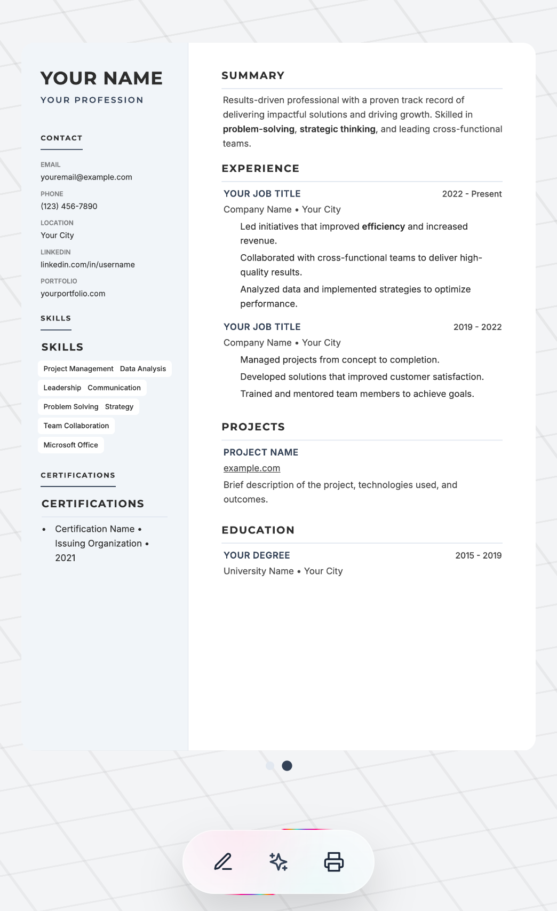
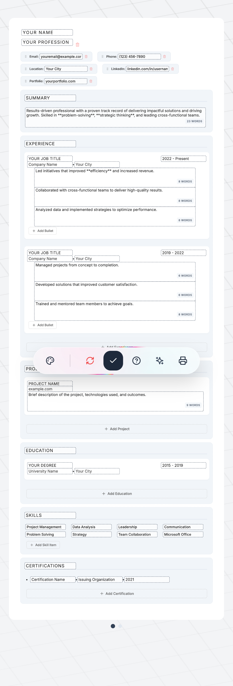

# 📄 PocketResume Builder PWA

[](https://masterkn48.github.io/resumeBuilderPWA/)
[](https://masterkn48.github.io/resumeBuilderPWA/)

PocketResume is a modern, interactive resume builder designed for speed, flexibility, and professional results. It features a live side-by-side preview, multiple templates, and flawless PDF export capabilities, all packaged as a lightweight PWA.

[**🌐 Launch App**](https://masterkn48.github.io/resumeBuilderPWA/)

## 📸 Screenshots

<p align="center">
  
  
  
</p>

---

## 🏗️ Project Architecture

The project is built using **Preact** for high performance and a small bundle size. It follows a modular architecture where data management, layout logic, and UI components are strictly separated.

### Core Philosophy

1.  **Data-Driven UI:** The entire resume is represented by a single JSON object.
2.  **On-Device AI:** All AI features (parsing, chat) run locally via WebGPU/Transformers.js for total privacy.
3.  **Style Isolation:** Modular CSS ensures that templates can coexist without style leakage.

---

## ✨ Features

- **Dual-Backend AI Engine:** On-device WebGPU-powered AI with automatic WASM/CPU fallback for maximum compatibility across all devices.
- **Remote AI Fallback:** Support for OpenAI-compatible APIs (OpenAI, Groq, local LLMs) as a high-performance alternative to on-device inference.
- **AI Resume Parsing:** Extract data directly from existing PDF resumes using semantic AI analysis (no server-side processing).
- **PWA & Offline:** Works without an internet connection and can be installed as a native app.
- **Live Templates:** Instantly switch between "Classic" and "Modern" layouts.
- **Interactive Drag & Drop:** Rearrange sections on the fly using native HTML5 drag events.
- **Smart Content Editing:** Markdown-style bolding support and automatic field hiding for empty data.
- **Dynamic Scaling:** Mobile-first design that auto-scales the resume to fit any screen size.
- **Privacy First:** All data is stored locally in your browser's `localStorage`. No accounts required.

---

## 📂 File Structure & Details

### `/src`

- **`App.jsx`**: The main entry point. Orchestrates global state, handles PWA lifecycle, and implements global error/OOM detection for mobile stability.
- **`/components/AI`**:
  - **`AIContainer.jsx`**: Orchestrates state between the UI, the Web Worker, and Remote API fallbacks.
  - **`AIChatWindow.jsx`**: Feature-rich chat interface with a dedicated Settings panel for custom model IDs and Remote API keys.
- **`/utils`**:
  - **`aiWorker.js`**: Web Worker handling local AI inference. Supports automatic WebGPU-to-WASM fallback.
  - **`aiConfigManager.js`**: Centralized manager to sync AI settings (Model IDs, API keys) between the chat assistant and resume parser.
  - **`resumeParser.js`**: Logic for AI-powered resume extraction, now optimized to use the unified AI settings.
  - **`aiUtils.js`**: Utilities for markdown formatting and Remote API streaming.
  - **`pdfParser.js`**: Client-side PDF text extraction engine.

---

## 🛠️ Key Methods & Logic

### Data Persistence

Data is automatically synced to `localStorage` on every change via `useResumeData`.

### Print Logic (`handlePrint`)

Disables Edit Mode, applies specialized scaling for mobile, and injects a `mobile-print` class for pixel-perfect PDF generation.

---

## 🚀 Development

This project uses `bun` as its primary package manager and `vite` for building.

```bash
# Install dependencies
bun install

# Start development server
bun run dev

# Build for production
bun run build
```

## 📄 Best Results for Printing

1.  **Destination:** Save as PDF
2.  **Margins:** Set to **Default** (The app handles its own 15mm margins).
3.  **Options:** Ensure **Background Graphics** is **checked**.

---

Developed with ❤️ by [MasterKN48](https://github.com/MasterKN48)
